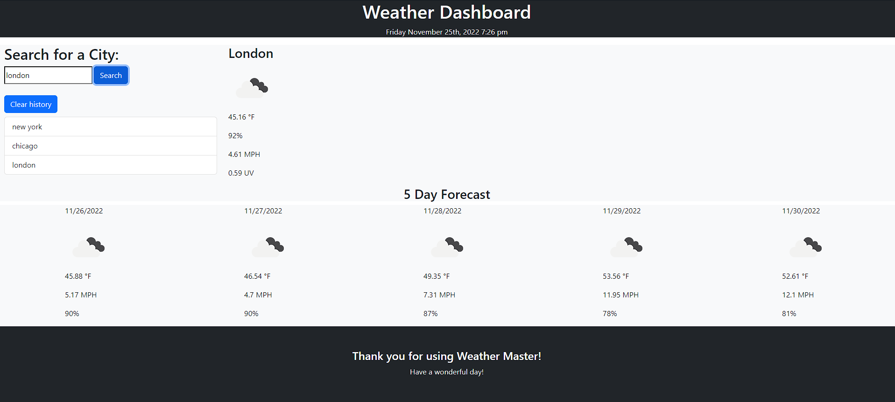

# Weather Master

## About this App

### Description

Weather Master is a weather app that uses Open Weather API to fetch and display current weather along with a 5-day forcast for a given city.

### User Story

As a user about leave home, I would like an application that allows me to see the weather. When I am on the homepage, I am presented with a form where I can enter a city name. After submitting the form, I am presented with the current weather along with a 5-day forcast for that city.

### Features

* The application displays the city name, temperature, humidity, uv index, and wind speed for the location provided along with a picture and deciprtion for the weather.
* Styling for the application was made entirely using Boostrap and is mobile responsive.
* Recent city searches by users are saved to be easier obtained for later use.

### Built With

- HTML
- CSS
- JavaScript
- Moment.JS
- Boostrap

## Deployed Application

<a href="https://calebfunderburk.github.io/Weather-Master/" target="_blank">Click here</a> to view this application.

## Installation

This program can be run through a browser using the above link to the deployed application. In order to run this program locally you will need to:

* Clone this repository to receive all the files.

## Screenshot

## Contributions

Caleb Funderburk
